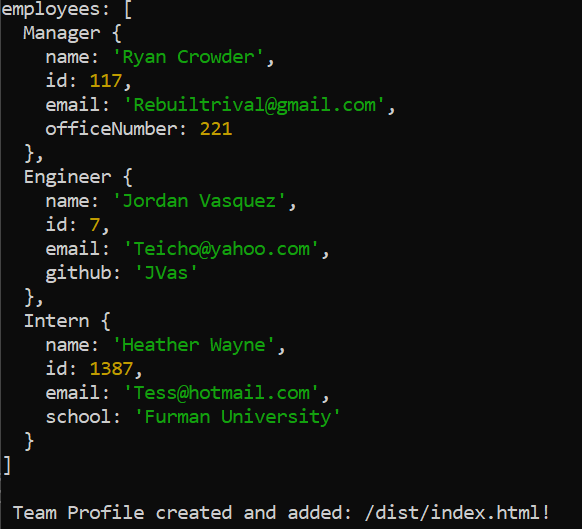

# #10: Team Profile Generator

## Description: Using node prompts, this app will create and populate an HTML about your development team, includes tests of functionality

## Table of Contents

- [Installation](#installation)
- [Usage](#usage)
- [Tests](#tests)
- [Questions](#questions)

# Installation:

    Run 'node index.js' from terminal

# Usage:

    Answer questions about your team for page generation

# Tests:

    Run 'npm run test' from terminal

# Questions: https://github.com/Crowderyan

### Email me: <a href="mailto:Rebuiltrival@gmail.com" hspace="20">Rebuiltrival@gmail.com</a>
